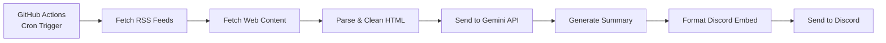

# 🤖 AI Newsletter Automation Bot

A **100% free**, fully automated system that fetches, summarizes, and delivers daily AI newsletter digests to your Discord channel using GitHub Actions.

## 📋 Table of Contents
- [Architecture & Tools](#architecture--tools)
- [Features](#features)
- [Newsletter Sources](#newsletter-sources)
- [Setup Guide](#setup-guide)
  - [1. Prerequisites](#1-prerequisites)
  - [2. Get Your API Keys](#2-get-your-api-keys)
  - [3. Repository Setup](#3-repository-setup)
  - [4. Configure GitHub Secrets](#4-configure-github-secrets)
  - [5. Test the Automation](#5-test-the-automation)
- [How It Works](#how-it-works)
- [Customization](#customization)
- [Troubleshooting](#troubleshooting)
- [Cost Breakdown](#cost-breakdown)

---

## 🏗️ Architecture & Tools

This automation uses a **serverless architecture** with zero hosting costs:

| Component | Technology | Purpose |
|-----------|-----------|---------|
| **Scheduler** | GitHub Actions | Runs the automation daily via cron job |
| **Runtime** | Python 3.11 | Fetches & processes newsletter data |
| **Data Sources** | RSS Feeds + Web Scraping | Retrieves latest newsletter content |
| **AI Summarization** | Google Gemini API (Free Tier) | Generates concise 5-minute summaries |
| **Delivery** | Discord Webhooks | Sends formatted summaries to your channel |

**Why this stack?**
- ✅ **Completely free** (no credit card required)
- ✅ **Serverless** (no server management)
- ✅ **Automated** (set it and forget it)
- ✅ **Reliable** (GitHub's infrastructure)

---

## ✨ Features

- 📰 **Fetches from 3 Top AI Newsletters:**
  - TLDR AI
  - The Rundown AI
  - Ben's Bites
  
- 🤖 **AI-Powered Summaries:**
  - Condensed "5-minute read" format
  - Key highlights, takeaways, and notable mentions
  - Clean, structured output

- 📅 **Daily Automation:**
  - Runs automatically every day at 8:00 AM UTC
  - Can be manually triggered anytime

- 💬 **Discord Integration:**
  - Rich embed formatting
  - Clickable links to original articles
  - Professional appearance

---

## 📰 Newsletter Sources

### Data Source Details

| Newsletter | Source Type | URL |
|-----------|-------------|-----|
| **TLDR AI** | RSS Feed | `https://tldr.tech/ai/feed` |
| **Ben's Bites** | RSS Feed | `https://www.bensbites.co/feed` |
| **The Rundown AI** | Web Scraping | `https://www.therundown.ai/` |

> **Note:** The Rundown AI doesn't offer a public RSS feed, so we scrape their website directly. Both methods are handled seamlessly by the script.

---

## 🚀 Setup Guide

### 1. Prerequisites

- A GitHub account (free)
- A Discord server where you have admin permissions
- 10 minutes of setup time

### 2. Get Your API Keys

#### A) **Discord Webhook URL**

1. Open your Discord server
2. Go to **Server Settings** → **Integrations** → **Webhooks**
3. Click **New Webhook**
4. Give it a name (e.g., "AI Newsletter Bot")
5. Select the channel where you want to receive summaries
6. Click **Copy Webhook URL**
7. Save this URL securely

**Format:** `https://discord.com/api/webhooks/123456789/ABCDEFG...`

#### B) **Google Gemini API Key**

1. Visit [Google AI Studio](https://makersuite.google.com/app/apikey)
2. Sign in with your Google account
3. Click **Get API Key** or **Create API Key**
4. Copy the generated key
5. Save this key securely

**Free Tier Limits:**
- 60 requests per minute
- 1,500 requests per day
- More than enough for this use case!

---

### 3. Repository Setup

#### Option A: Use This Repository Directly

1. **Fork this repository** to your GitHub account:
   - Click the **Fork** button at the top right

2. **Clone your fork locally** (optional, for testing):
   ```bash
   git clone https://github.com/YOUR_USERNAME/Discord_Newsletter_Bot.git
   cd Discord_Newsletter_Bot
   ```

#### Option B: Create a New Repository

1. Create a new repository on GitHub (can be private)
2. Clone it locally:
   ```bash
   git clone https://github.com/YOUR_USERNAME/your-repo-name.git
   cd your-repo-name
   ```
3. Copy all files from this project into your repository
4. Commit and push:
   ```bash
   git add .
   git commit -m "Initial commit: AI Newsletter Bot"
   git push origin main
   ```

---

### 4. Configure GitHub Secrets

GitHub Secrets keep your API keys secure and hidden from the public.

1. Go to your repository on GitHub
2. Click **Settings** → **Secrets and variables** → **Actions**
3. Click **New repository secret**
4. Add the following two secrets:

**Secret 1:**
- **Name:** `DISCORD_WEBHOOK_URL`
- **Value:** Your Discord webhook URL from Step 2A

**Secret 2:**
- **Name:** `GEMINI_API_KEY`
- **Value:** Your Gemini API key from Step 2B

5. Click **Add secret** for each

---

### 5. Test the Automation

#### Manual Test (Recommended First)

1. Go to **Actions** tab in your GitHub repository
2. Click on **Daily AI Newsletter Digest** workflow
3. Click **Run workflow** → **Run workflow**
4. Wait ~30-60 seconds
5. Click on the running workflow to see logs
6. Check your Discord channel for the summaries!

#### Schedule Configuration

The automation is set to run daily at **8:00 AM UTC** by default.

**To change the schedule:**
1. Open [.github/workflows/daily.yml](.github/workflows/daily.yml)
2. Modify the cron expression:
   ```yaml
   schedule:
     - cron: '0 8 * * *'  # Min Hour Day Month Weekday
   ```

**Common schedules:**
- `'0 8 * * *'` - 8:00 AM UTC daily
- `'0 14 * * *'` - 2:00 PM UTC daily
- `'0 0 * * *'` - Midnight UTC daily
- `'0 */12 * * *'` - Every 12 hours

Use [crontab.guru](https://crontab.guru/) to generate custom schedules.

---

## 🔧 How It Works

### Workflow Breakdown



### The Summarization Prompt

The script uses **prompt engineering** to ensure consistent, high-quality summaries:

```python
prompt = f"""You are an expert at creating concise, actionable summaries of AI newsletters for busy professionals.

ARTICLE TITLE: {article['title']}
SOURCE: {article['source']}
PUBLISHED: {article['published']}

ARTICLE CONTENT:
{article['content']}

INSTRUCTIONS:
Create a summary that can be read in 5 minutes or less. Format your response EXACTLY as follows:

🔑 KEY HIGHLIGHTS (3-5 bullet points)
• [Most important news/development]
• [Second key point]
• [Third key point]

💡 MAIN TAKEAWAYS (2-3 bullet points)
• [What this means for AI practitioners/enthusiasts]
• [Practical implications]

🔗 NOTABLE MENTIONS (if applicable)
• [Any significant tools, companies, or research mentioned]

Keep it sharp, skip the fluff, and focus on what matters. Use emojis sparingly for visual appeal.
"""
```

**Why this prompt works:**
- ✅ **Structured format:** Ensures consistency across all summaries
- ✅ **Action-oriented:** Focuses on takeaways, not just facts
- ✅ **Concise:** Enforces brevity with the "5-minute read" constraint
- ✅ **Professional:** Balances emoji usage for readability

---

## 🎨 Customization

### Add More Newsletters

Edit `main.py` and add to the `NEWSLETTER_SOURCES` dictionary:

```python
NEWSLETTER_SOURCES = {
    'Your Newsletter Name': {
        'url': 'https://example.com/feed',
        'type': 'rss'  # or 'web' for scraping
    },
    # ... existing sources
}
```

### Change Summary Style

Modify the prompt in the `summarize_with_gemini()` function to match your preferred format.

### Test Locally

1. Create a `.env` file (copy from `.env.example`):
   ```bash
   cp .env.example .env
   ```

2. Add your credentials to `.env`:
   ```env
   DISCORD_WEBHOOK_URL=your_webhook_url_here
   GEMINI_API_KEY=your_api_key_here
   ```

3. Install dependencies:
   ```bash
   pip install -r requirements.txt
   ```

4. Run the script:
   ```bash
   python main.py
   ```

---

## 🔍 Troubleshooting

### Common Issues

**1. Workflow not running automatically**
- Check that the `.github/workflows/daily.yml` file is in the correct location
- Ensure the repository is not archived
- Verify GitHub Actions is enabled in Settings → Actions

**2. "DISCORD_WEBHOOK_URL not set" error**
- Double-check the secret name matches exactly: `DISCORD_WEBHOOK_URL`
- Ensure no extra spaces in the secret value

**3. "GEMINI_API_KEY not set" error**
- Verify the secret name: `GEMINI_API_KEY`
- Check that the API key is still valid at [Google AI Studio](https://makersuite.google.com/app/apikey)

**4. No content in Discord messages**
- Check the workflow logs in the Actions tab
- Look for specific error messages in the Python output
- Verify the newsletter RSS feeds are still accessible

**5. Rate limit errors**
- Gemini free tier: Wait until the next day (resets at midnight UTC)
- Add delays between requests in `main.py` if needed

### View Logs

1. Go to **Actions** tab
2. Click on the workflow run
3. Click on the **fetch-and-send** job
4. Expand the **Run newsletter automation** step

---

## 💰 Cost Breakdown

| Service | Monthly Cost | Notes |
|---------|--------------|-------|
| GitHub Actions | **$0** | 2,000 minutes/month free for public repos<br/>This uses ~2 min/day = 60 min/month |
| Google Gemini API | **$0** | Free tier: 60 requests/min, 1,500/day<br/>This uses ~3 requests/day |
| Discord Webhooks | **$0** | Unlimited webhooks |
| **Total** | **$0** | ✅ Completely free! |

---

## 📝 File Structure

```
Discord_Newsletter_Bot/
├── .github/
│   └── workflows/
│       └── daily.yml          # GitHub Actions workflow
├── main.py                    # Main Python script
├── requirements.txt           # Python dependencies
├── .env.example              # Environment variable template
├── .gitignore                # Git ignore rules
└── README.md                 # This file
```

---

## 🤝 Contributing

Feel free to open issues or submit pull requests to improve this automation!

---

## 📄 License

This project is open source and available under the MIT License.

---

## 🙋 FAQ

**Q: Can I add more newsletters?**  
A: Yes! Just add them to the `NEWSLETTER_SOURCES` dictionary in `main.py`.

**Q: Can I change the summary format?**  
A: Absolutely! Modify the prompt in the `summarize_with_gemini()` function.

**Q: Will this work with private repositories?**  
A: Yes! GitHub Actions includes 2,000 free minutes/month for private repos too.

**Q: Can I send to multiple Discord channels?**  
A: Yes! Create multiple webhooks and modify the script to loop through them, or create separate workflows.

**Q: What if a newsletter changes its RSS feed URL?**  
A: Simply update the URL in the `NEWSLETTER_SOURCES` dictionary.

---

**Enjoy your automated AI newsletter digests! 🚀**
